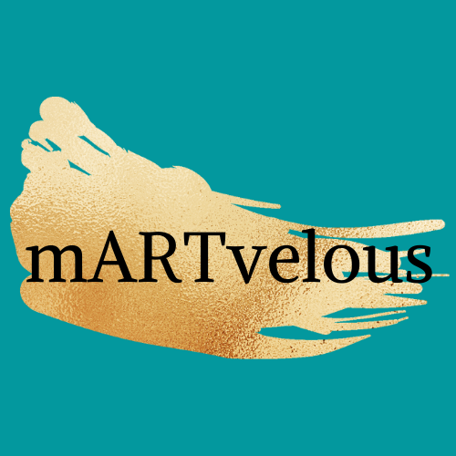

<h1 align='center'>mARTvelous</h1>

## Decription
Whether you need to take a break, do a quick sketch, or express yourself, mARTvelous is a paint application that allows user to bring out their inner artist. As well as provide you the tool necessary for you.

Project Link: [mARTvelous](https://martvelous.netlify.app/)

mARTvelous is an application built to be submitted in Mintbean's November Hiring Hackathon: Jr. Web Devs. Mintbean is a professional community for software developer. For more information, please vist [MintBean](https://info.mintbean.io/). 

### Tech Stack / Built With

#### Front End
- [React.js](https://reactjs.org/)
- [Bootstrap](https://react-bootstrap.github.io/)

#### Dependencies
- React Router Dom 
- React Lottie
- React Canvas Draw

#### Deployment
- Netlify

## Getting Started
To get a local copy up and running follow these simple steps:

### Installation

mARTvelous requires `yarn` to run.

1. Download the repo using git.
    `git clone git@github.com:trieule50/martvelous.git`
2. Install Yarn dependencies
    `yarn add react-bootstrap react-router-dom react-lottie react-canvas-draw`
3. Start the Server
    `yarn start`

## Learning Experience

## Features / Accomplishments
- Users can drag their mouse across the screen to make free-form lines.
- Users can click areas of the screen with their mouse to fill them with a color. 
- Users can choose a picture to color.

## Future Directions
- [] Create a backend allowing users to do the following:
    - [] Share artwork
    - [] Edit artwork
    - [] Post artwork
    - [] Comment artwork
- [] Add more customizing feature
- [] Adding different texture (pencil, brush, airbrush tool)

## Contributing
Contributions are what make the open source community such an amazing place to learn, inspire, and create. Any contributions you make are greatly appreciated.

If you have a suggestion that would make this better, please fork the repo and create a pull request. 

Steps: 
1. Fork the Project
2. Create your Feature Branch
    - Ex. `git checkout -b <your_branch_name>`
3. Add your Changes
    - Ex. `git add .`
4. Commit your Changes
    - Ex. `git commit -m "Description of your Changes"`
5. Push to the Branch
    - Ex. `git push origin <your_branch_name>`
6. Open a Pull Request

## License
- License - Not Specified

## Acknowledgments
- [Animated SVG --- Pixeltrue](https://www.pixeltrue.com/free-illustrations)
- [Icons --- icon8](https://icons8.com/icons)
- [Bootstrap](https://react-bootstrap.netlify.app/getting-started/introduction/)

## Contact

Trieu Le -- trieule50@yahoo.com

Project Link: [mARTvelous](https://martvelous.netlify.app/)

